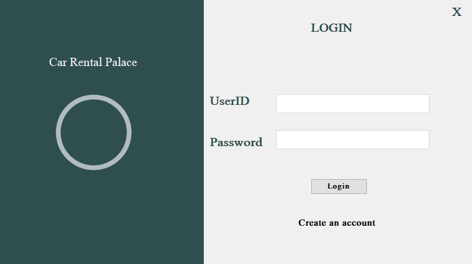

A desktop-based Car Rental Management System developed using C#, .NET Framework, WinForms, and MySQL.
This was my second software development project, designed to provide a complete and user-friendly environment for managing internal car rental operations efficiently.

The system was developed to automate and maintain rental information digitally instead of relying on manual record keeping. It enables rental service employees to manage customers, cars, rentals, returns, and invoices through an intuitive graphical interface.

# Key Features
- Secure employee authentication system with Login and Registration
- Password protection using SHA-256 hashing
- Car availability management
- Customer information management
- Rental booking system
- Automatic fare calculation based on rental duration
- Return management with delay and fine calculation
- Invoice generation and printing support
- Fully integrated MySQL database system
- User-friendly desktop interface using Windows Forms
# Technologies Used

- Programming Language: C#
- Framework: .NET Framework
- UI Framework: WinForms
- Database: MySQL
- Database Management Tool: XAMPP / phpMyAdmin
- Security: SHA-256 Password Hashing

# System Workflow
- Employee logs into the system
- Customer information is added or retrieved
- Available cars are displayed
- Employee selects a car and rental duration
- System automatically calculates rental fees
- Rental information is stored in the database
- After returning the car, delay and fines are calculated if applicable
- Invoice can be printed and saved for future reference

# Database Schema

## Database Creation:
`CREATE DATABASE carrental;`

## Database Tables
- usertb1
- cartb1
- customertb
- rentaltb
- returntb 

# Tables Structures

## Table usertb1
Stores employee authentication information.
```
CREATE TABLE usertb1 (
    Id INT PRIMARY KEY,
    Uname VARCHAR(50) NOT NULL UNIQUE,
    Upass VARCHAR(64) NOT NULL
);
```
## Table cartb1
Stores car information and availability status.
```
CREATE TABLE cartb1 (
    Regno VARCHAR(20) PRIMARY KEY,
    Brand VARCHAR(50) NOT NULL,
    Model VARCHAR(50) NOT NULL,
    Available CHAR(3) NOT NULL CHECK (Available IN ('YES', 'NO')),
    Price DECIMAL(10,2) NOT NULL
);
```
## Table customertb
Stores customer details.
```
CREATE TABLE customertb (
    custid INT PRIMARY KEY,
    custname VARCHAR(100) NOT NULL,
    custaddress VARCHAR(200),
    phone VARCHAR(15) NOT NULL,
    nid VARCHAR(20)
);
```
## Table rentaltb
Stores rental transaction information.
```
CREATE TABLE rentaltb (
    rentid INT PRIMARY KEY,
    carreg VARCHAR(20) NOT NULL,
    custname VARCHAR(100) NOT NULL,
    rentdate DATE NOT NULL,
    returnDate DATE NOT NULL,
    rentfee DECIMAL(10,2) NOT NULL,
    RentDay INT NOT NULL,
    Total DECIMAL(10,2) NOT NULL,
    FOREIGN KEY (carreg) REFERENCES cartb1(Regno) ON DELETE RESTRICT ON UPDATE CASCADE
);
```
## Table returntb
Stores returned car information, delays, and fines.
```
CREATE TABLE returntb (
    rentid INT PRIMARY KEY,
    carreg VARCHAR(20) NOT NULL,
    custname VARCHAR(100) NOT NULL,
    returndate DATE NOT NULL,
    delay VARCHAR(50),
    fine DECIMAL(10,2),
    FOREIGN KEY (rentid) REFERENCES rentaltb(rentid) ON DELETE CASCADE,
    FOREIGN KEY (carreg) REFERENCES cartb1(Regno)
);
```
# Project Highlights
- Applied real-world database normalization concepts
- Implemented relational database management using foreign keys
- Developed secure authentication with hashed passwords
- Designed a complete CRUD-based desktop application
- Integrated invoice generation and rental tracking
- Improved understanding of software architecture, database connectivity, and WinForms UI design
# The outlook of the project:
## The login page


# Future Improvements
- Migration to ASP.NET Core Web Application
- Online booking support
- Payment gateway integration
- Admin dashboard with analytics
- Role-based authentication
- Email/SMS notification system
- Cloud database integration
